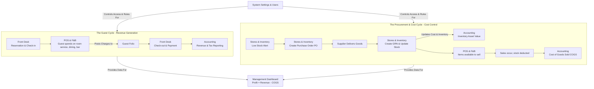

# 🏨 Ghana Hotel Management System - SaaS Platform

A **multi-tenant SaaS platform** for comprehensive, integrated hotel management designed specifically for the Ghanaian market and scalable globally. Features full compliance with local tax regulations, seamless integration between all operational modules, and enterprise-grade multi-tenancy support.

## 🌟 System Overview

This system demonstrates **true system thinking** - where every module is interconnected and changes in one area automatically propagate throughout the entire ecosystem. It's not just a collection of separate tools, but a unified operational platform.

## 🆕 Latest Updates - Enhanced Front Office Operations

### ✨ **New Check-In Management System**
- **🔑 Unified Check-In Dashboard**: Single interface for both walk-ins and existing reservations
- **🚶‍♂️ Walk-In Processing**: Streamlined check-in for guests without prior bookings
- **🔍 Reservation Search**: Quick search and filter for existing reservations
- **📱 Quick Actions**: One-click access to common check-in operations

### ✨ **Enhanced Data Structure & Analytics**
- **📊 Separated Columns**: All data elements now in individual columns for optimal analysis
- **👤 Staff Accountability**: Complete audit trail with staff ID, username, and timestamps
- **⏰ Granular Timestamps**: Separate date and time columns for comprehensive tracking
- **🔗 Relational Database Design**: Aligned with enterprise-grade database architecture

### ✨ **Advanced Table Structures**

#### **Check-ins Table (17 Columns)**
- Unique ID, Guest Name, Contact, Room, Rate, Stay Details
- Payment & Source, Staff ID, Staff Username
- Created Date/Time, Updated Date/Time, Processed Date/Time
- Status, Actions

#### **In-House Table (24 Columns)**
- Guest Profile ID, Phone, Email, Room Number, Room Type, Room Rate
- Check-in Date/Time, Departure Date/Time, Adults, Children
- Total Charges, Total Payments, Outstanding Balance, Payment Method
- Source, Staff ID, Staff Username, Folio ID, Status, Actions

#### **Check-outs Table (30 Columns)**
- Complete financial tracking, checkout details, room status
- Staff accountability, timestamps, confirmation numbers
- Late checkout indicators, housekeeping status, final settlement

### ✨ **Analytics & Reporting Capabilities**
- **📈 Real-time Dashboards**: Live performance monitoring
- **🔍 Data Export**: CSV/Excel export for external analysis
- **📊 Performance Metrics**: Staff efficiency, processing speed, revenue analysis
- **🎯 Business Intelligence**: Guest behavior, operational trends, financial insights

## ☁️ SaaS Architecture

### Multi-Tenant Platform
- **Scalable Infrastructure**: Built for hundreds of hotels, each with their own isolated environment
- **Tenant Isolation**: Complete data separation between different hotel chains
- **Plan-Based Features**: Starter, Professional, Enterprise, and Custom plans with feature gating
- **White-Label Support**: Hotels can customize branding, colors, and company information

### Enterprise Features
- **Multi-Property Management**: Single hotel chains can manage multiple properties
- **API Access**: RESTful APIs for third-party integrations
- **Webhook Support**: Real-time notifications to external systems
- **Advanced Analytics**: Cross-property reporting and insights
- **Role-Based Access Control**: Granular permissions per user and property

### Scalability & Performance
- **Cloud-Native Design**: Built for horizontal scaling
- **Caching Layers**: Redis-based caching for optimal performance
- **CDN Support**: Global content delivery for international hotels
- **Load Balancing**: Automatic traffic distribution across servers
- **Database Sharding**: Multi-tenant database architecture

## 🔗 Core Integration Architecture

### The Central Nervous System

The entire system revolves around two core cycles that are **automatically synchronized**:

1. **The Guest Cycle** - Revenue Generation
2. **The Procurement & Cost Cycle** - Cost Control

Every module plays a role in one or both of these cycles, creating a **holistic operational ecosystem**.

## 📊 Module Integration Map



## 🏗️ Module Breakdown

### 1. **Front Desk & Guest Management** 🏨
- **Purpose**: Central nervous system for guest interactions
- **Integration**: Every guest action triggers cascading updates across all modules
- **Key Features**:
  - **🔑 Enhanced Check-In System**: Walk-ins and reservations in unified interface
  - **🏠 In-House Management**: Real-time guest tracking with comprehensive data
  - **🚪 Advanced Check-Out**: Complete settlement with financial tracking
  - **👤 Staff Authentication**: Complete accountability and audit trails
  - **📊 Analytics-Ready Tables**: Separated columns for optimal data analysis
  - Real-time guest folio management
  - Automatic room status synchronization
  - Integrated payment processing
  - Ghanaian ID verification (Ghana Card, Passport)

### 2. **Food & Beverage (F&B) Management** 🍽️
- **Purpose**: High-volume operational management with real-time inventory integration
- **Integration**: 
  - **LINKED** to Front Desk for room charges
  - **LINKED** to Stores for automatic inventory depletion
  - **LINKED** to Accounting for COGS and revenue tracking
- **Key Features**:
  - Multi-venue POS (Restaurant, Bar, Room Service)
  - Kitchen Display System (KDS)
  - Automatic recipe costing
  - Real-time stock level updates

### 3. **Stores & Inventory Management** 📦
- **Purpose**: Centralized control of all hotel supplies and costs
- **Integration**:
  - **LINKED** to F&B for automatic stock deduction
  - **LINKED** to Accounting for asset valuation and COGS
  - **LINKED** to all departments for supply requests
- **Key Features**:
  - 3-way matching (PO → GRN → Invoice)
  - Automatic Ghanaian VAT calculation
  - Real-time stock level monitoring
  - Supplier performance tracking

### 4. **Accounting & Financial Management** 🧾
- **Purpose**: Automated financial tracking with Ghanaian compliance
- **Integration**:
  - **LINKED** to all operational modules
  - **LINKED** to Ghana Revenue Authority (GRA) requirements
- **Key Features**:
  - Ghana-specific Chart of Accounts
  - Automatic journal entry generation
  - VAT/NHIL/GETFund/Tourism Levy compliance
  - Real-time financial reporting

### 5. **Human Resources & Payroll** 👥
- **Purpose**: Strategic workforce management integrated with operational needs
- **Integration**:
  - **LINKED** to System Settings for automatic permissions
  - **LINKED** to Accounting for payroll processing
  - **LINKED** to Operations for demand-based scheduling
- **Key Features**:
  - Ghanaian compliance (SSNIT, TIN, Ghana Card)
  - Integrated shift management
  - Performance tracking
  - Automated payroll calculations

### 6. **System Settings & Security** ⚙️
- **Purpose**: Central control panel for the entire ecosystem
- **Integration**: **LINKED** to every module for consistent behavior
- **Key Features**:
  - Role-based access control (RBAC)
  - Ghanaian tax rate configuration
  - Audit trail management
  - System-wide security policies

## 🔑 Front Office Operations - Detailed Features

### **Check-In Management System**
- **Unified Interface**: Single dashboard for all check-in operations
- **Walk-In Processing**: Streamlined guest registration without reservations
- **Reservation Search**: Quick lookup and filter for existing bookings
- **Staff Authentication**: Complete accountability for all operations
- **Real-Time Updates**: Instant synchronization across all modules

### **In-House Guest Management**
- **Live Tracking**: Real-time status of all checked-in guests
- **Financial Monitoring**: Live folio balances and payment tracking
- **Room Management**: Automatic room status updates
- **Extension Handling**: Easy stay extension processing
- **Early Checkout**: Streamlined departure processing

### **Check-Out & Settlement**
- **Complete Financial Settlement**: All charges, payments, and balances
- **Room Status Updates**: Automatic housekeeping notifications
- **Confirmation Generation**: Unique receipt numbers and confirmations
- **Late Checkout Handling**: Flexible departure time management
- **Audit Trail**: Complete record of all checkout activities

### **Data Analytics & Reporting**
- **Separated Columns**: Optimal structure for data analysis
- **Export Capabilities**: CSV/Excel export for external tools
- **Performance Metrics**: Staff efficiency and operational insights
- **Financial Analysis**: Revenue patterns and payment trends
- **Guest Behavior**: Stay patterns and preference analysis

## 🇬🇭 Ghanaian Market Features

### Tax Compliance Automation
- **15% VAT** calculation and tracking
- **2.5% NHIL** (National Health Insurance Levy)
- **2.5% GETFund** (Ghana Education Trust Fund)
- **1% Tourism Levy** on hospitality services
- **Automatic GRA reporting** format generation

### Local Payment Integration
- **Mobile Money (MoMo)** support
- **Ghana Card** verification
- **Local currency (GHS)** handling
- **SSNIT compliance** for payroll

## 🔄 Real-World Integration Examples

### Example 1: Enhanced Guest Check-In
1. **Front Desk Staff** processes check-in (walk-in or reservation)
2. **System automatically**:
   - Creates unique check-in ID with timestamp
   - Records staff ID and username for accountability
   - Updates room status to occupied
   - Creates guest folio for charges
   - Synchronizes with in-house management
   - Updates housekeeping status
3. **Result**: Complete audit trail with zero manual data entry

### Example 2: In-House Guest Management
1. **Guest** makes additional purchases (F&B, services)
2. **System automatically**:
   - Posts charges to guest folio
   - Updates in-house table in real-time
   - Calculates outstanding balance
   - Notifies front desk of payment due
3. **Result**: Live financial status with automatic updates

### Example 3: Guest Check-Out Process
1. **Front Desk Staff** processes checkout
2. **System automatically**:
   - Calculates final folio total
   - Processes final payment
   - Generates confirmation number
   - Updates room status for housekeeping
   - Creates complete audit trail
   - Removes guest from in-house table
3. **Result**: Complete settlement with comprehensive documentation

### Example 4: Inventory Purchase
1. **Storekeeper** creates purchase order
2. **System automatically**:
   - Creates commitment in accounting
   - Sends PO to supplier
   - Tracks delivery status
3. **Upon receipt**:
   - Updates inventory levels
   - Creates asset journal entry
   - Calculates input VAT
   - Updates supplier balance

### Example 5: Night Audit Process
1. **System automatically**:
   - Closes all guest folios
   - Posts room revenue
   - Reconciles all interfaces
   - Generates compliance reports
2. **Result**: Perfect accuracy with zero manual reconciliation

## 🚀 Key Benefits of Integration

### 1. **Elimination of Double Entry**
- Data entered once flows throughout the system
- No more manual reconciliation between modules
- Perfect accuracy guaranteed

### 2. **Real-Time Business Intelligence**
- Live dashboard showing current operational status
- Instant visibility into profitability
- Proactive decision-making capability

### 3. **Ghanaian Compliance Automation**
- Tax calculations are 100% accurate
- GRA reporting is automated
- Audit trail is comprehensive and tamper-proof

### 4. **Operational Efficiency**
- Staff can focus on guest service, not data entry
- Managers have real-time operational visibility
- System prevents errors before they occur

### 5. **Enhanced Guest Experience**
- Faster check-in and check-out processes
- Accurate billing with real-time updates
- Seamless service across all departments

### 6. **Staff Accountability**
- Complete audit trail for all operations
- Performance tracking and efficiency metrics
- Clear responsibility assignment

## 🏢 Tenant Management

### Hotel Onboarding
1. **Sign Up Process**: Hotels register with basic information
2. **Plan Selection**: Choose from Starter, Professional, Enterprise, or Custom plans
3. **Property Setup**: Configure hotel details, rooms, and operational settings
4. **User Invitation**: Invite staff members with appropriate roles
5. **Training & Go-Live**: System training and production deployment

### Plan Tiers
- **Starter Plan** (₵500/month):
  - Up to 20 rooms
  - Basic front desk operations
  - Standard reporting
  - Email support
  
- **Professional Plan** (₵1,200/month):
  - Up to 100 rooms
  - Full operational suite
  - Multi-property support
  - API access
  - Priority support
  
- **Enterprise Plan** (₵2,500/month):
  - Unlimited rooms
  - White-label branding
  - Advanced analytics
  - Custom integrations
  - Dedicated support
  
- **Custom Plan** (Price on request):
  - Tailored features
  - Custom development
  - On-premise options
  - SLA guarantees

## 🛠️ Technical Architecture

### Frontend
- **Next.js 14** with React 18
- **HeroUI** component library
- **Responsive design** for all devices
- **Offline capability** with service workers

### State Management
- **Zustand** for global state
- **Real-time updates** across all modules
- **Event-driven architecture** for module communication

### Data Flow
- **Unidirectional data flow** for consistency
- **Automatic synchronization** between stores
- **Event logging** for audit trails

### Enhanced Data Structure
- **Separated columns** for optimal analytics
- **Staff authentication** with complete accountability
- **Granular timestamps** for comprehensive tracking
- **Analytics-ready** data attributes for external tools

## 📱 User Experience

### Role-Based Dashboards
- **Front Desk**: Enhanced guest-focused interface with unified check-in
- **F&B Staff**: Order and kitchen management
- **Storekeepers**: Inventory and purchasing
- **Managers**: Strategic overview and analytics
- **Accountants**: Financial compliance and reporting

### Mobile-First Design
- **Responsive layouts** for all screen sizes
- **Touch-optimized** interfaces
- **Offline functionality** for reliability

### Enhanced Front Office Interface
- **Unified Check-In**: Single interface for all check-in operations
- **Real-Time Updates**: Live synchronization across all modules
- **Staff Accountability**: Complete audit trail for all actions
- **Analytics Integration**: Data export and reporting capabilities

## 🔒 Security & Compliance

### Multi-Layer Security
- **Role-based access control** (RBAC)
- **Multi-factor authentication** for admin accounts
- **Complete audit trails** for all actions
- **Data encryption** in transit and at rest

### Ghanaian Legal Compliance
- **GRA audit readiness**
- **Data retention** compliance
- **Tax calculation accuracy**
- **Supplier verification** requirements

### Enhanced Audit Capabilities
- **Staff Authentication**: Every action tracked with staff ID and username
- **Timestamp Chain**: Complete history from creation to completion
- **Unique Identifiers**: No duplicate or conflicting records
- **Data Integrity**: All critical fields required and validated

## 🚀 Getting Started

### For Hotels (Tenants)
1. **Visit**: [app.ghana-hotel.com](https://app.ghana-hotel.com)
2. **Sign Up**: Create your hotel account
3. **Choose Plan**: Select the plan that fits your needs
4. **Configure**: Set up your hotel settings and preferences
5. **Go Live**: Start managing your hotel operations

### For Developers
#### Prerequisites
- Node.js 18+ 
- npm or yarn
- Modern web browser

#### Local Development
```bash
git clone <repository-url>
cd ghana-hotel-management
npm install
npm run dev
```

#### Environment Setup
```bash
# Copy environment template
cp .env.example .env.local

# Configure your development environment
NEXT_PUBLIC_API_URL=http://localhost:3000
NEXT_PUBLIC_TENANT_ID=dev-tenant
DATABASE_URL=your_database_url
REDIS_URL=your_redis_url
```

### Configuration
1. Set up Ghanaian tax rates in System Settings
2. Configure Chart of Accounts for your hotel
3. Set up user roles and permissions
4. Configure supplier information

## 📊 Monitoring & Analytics

### Real-Time Metrics
- **Occupancy rates** and revenue per room
- **Food cost percentages** and profitability
- **Inventory turnover** and supplier performance
- **Staff productivity** and guest satisfaction

### Enhanced Analytics Capabilities
- **Staff Performance**: Processing speed, efficiency metrics
- **Operational Trends**: Peak hours, processing delays, resource utilization
- **Financial Analysis**: Revenue patterns, payment trends, outstanding balances
- **Guest Insights**: Stay patterns, preferences, service quality metrics

### Automated Reporting
- **Daily operational reports**
- **Monthly financial statements**
- **GRA compliance reports**
- **Custom analytics dashboards**
- **Staff performance reports**
- **Guest satisfaction metrics**

## 💰 Business Model

### Revenue Streams
- **Subscription Plans**: Monthly/annual recurring revenue from hotel subscriptions
- **Transaction Fees**: Small percentage on payment processing
- **Premium Features**: Additional modules and advanced functionality
- **Professional Services**: Implementation, training, and custom development
- **Marketplace**: Commission on third-party integrations and services

### Market Strategy
- **Ghana-First**: Establish strong presence in the local market
- **Regional Expansion**: Expand to Nigeria, Kenya, South Africa, and Egypt
- **Partnerships**: Collaborate with hotel associations and tourism boards
- **Digital Marketing**: SEO, content marketing, and social media presence
- **Referral Program**: Incentivize existing customers to refer new hotels

### Competitive Advantages
- **Local Compliance**: Built specifically for Ghanaian tax and legal requirements
- **Integrated Platform**: All-in-one solution vs. multiple disconnected systems
- **Affordable Pricing**: Competitive pricing for the African market
- **Local Support**: Ghana-based support team with local language support
- **Mobile-First**: Optimized for mobile devices used by African hotel staff
- **Enhanced Analytics**: Advanced data analysis and reporting capabilities
- **Staff Accountability**: Complete audit trail and performance tracking

## 🔮 Future Enhancements

### Planned Features
- **AI-powered demand forecasting**
- **Advanced revenue management**
- **Integrated CRM system**
- **Mobile app for guests**
- **API integrations** with third-party services
- **Advanced analytics dashboards**
- **Predictive maintenance**
- **Guest satisfaction automation**

### Scalability
- **Multi-property support**
- **Cloud deployment options**
- **Enterprise-grade security**
- **International expansion** capabilities
- **Advanced reporting engine**
- **Custom analytics tools**

## 🤝 Contributing

This system is designed to be **extensible and maintainable**. Contributions are welcome in the following areas:

- **New module development**
- **Integration enhancements**
- **Ghanaian compliance updates**
- **Performance optimizations**
- **User experience improvements**
- **Analytics and reporting enhancements**
- **Staff management features**

## 📄 License

This project is licensed under the MIT License - see the LICENSE file for details.

## 🆘 Support

For support and questions:
- **Documentation**: Check the docs folder
- **Issues**: Use GitHub Issues
- **Discussions**: Join GitHub Discussions

---

## 🎯 System Philosophy

This hotel management system embodies **true system thinking** and **SaaS scalability**:

> *"Every action in one module creates a ripple effect throughout the entire ecosystem. We don't just build software - we create operational harmony that scales across continents."*

The result is a system where:
- **Data flows seamlessly** between all departments
- **Decisions are informed** by real-time information
- **Compliance is automatic** and error-free
- **Efficiency is maximized** through integration
- **Guest experience is enhanced** through operational excellence
- **Scalability is built-in** for global hotel chains
- **Customization is unlimited** for unique hotel needs
- **Analytics are comprehensive** for data-driven decisions
- **Staff accountability is complete** for operational excellence

## 🌍 Global Vision

Our mission is to **democratize hotel management technology** across Africa and beyond:

- **Affordable Access**: Make enterprise-grade hotel management accessible to hotels of all sizes
- **Local Compliance**: Ensure every hotel meets their local regulatory requirements
- **Operational Excellence**: Enable hotels to compete with international chains
- **Economic Growth**: Support the growth of the African hospitality industry
- **Technology Transfer**: Bring cutting-edge technology to emerging markets
- **Data Intelligence**: Provide advanced analytics for informed decision-making
- **Staff Development**: Enable performance tracking and continuous improvement

**Welcome to the future of hotel management - built in Ghana, scaling globally.** 🇬🇭🌍✨
